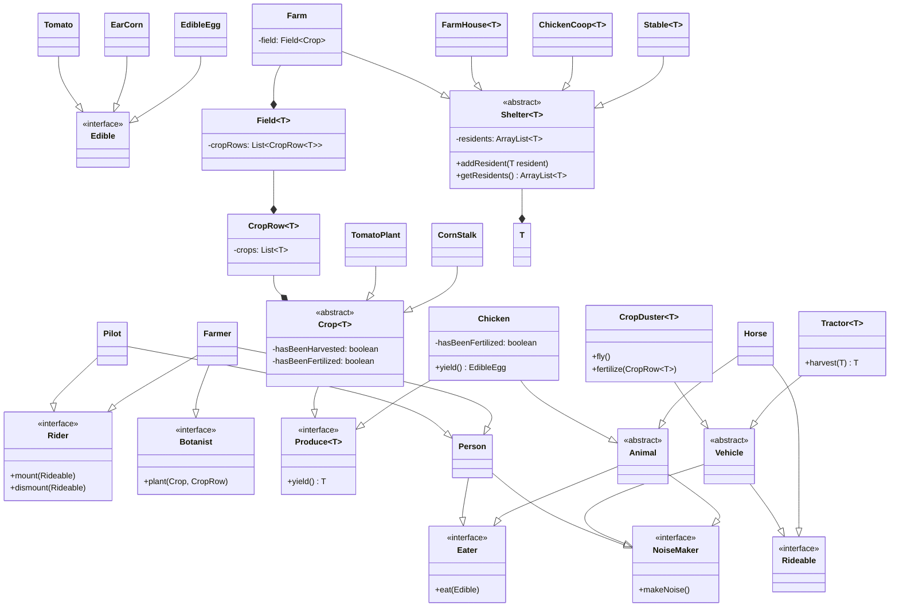

# Farm System UML Class Diagram

## Streamlined Design Features:

### **Core Concepts:**
- **Interfaces**: Define behavioral contracts (`Eater`, `NoiseMaker`, `Rideable`, etc.)
- **Generics**: Type-safe collections and producers (`Produce<T>`, `Crop<T>`, containers)
- **Inheritance**: Clean hierarchies avoiding multiple inheritance issues
- **Composition**: Farm contains specialized buildings and structures

### **Key Simplifications:**
1. **Removed verbose method signatures** - Focus on essential structure
2. **Consolidated vehicle hierarchy** - Simplified to core functionality
3. **Streamlined relationships** - Used composition (--*) for stronger ownership
4. **Essential attributes only** - Key fields like `hasBeenHarvested`, `hasBeenFertilized`
5. **Conditional Production** - `Chicken` yields `EdibleEgg` only when `hasBeenFertilized` is false

### **Generic Benefits:**
- `Produce<T>` ensures type-safe yielding
- Container classes (`CropRow<T>`, `Stable<T>`) work with any appropriate type
- `Tractor<T>` and `CropDuster<T>` are reusable for different crop types
- Compile-time type safety prevents runtime errors

This concise UML maintains all essential farm system relationships while demonstrating clean generic design patterns.
